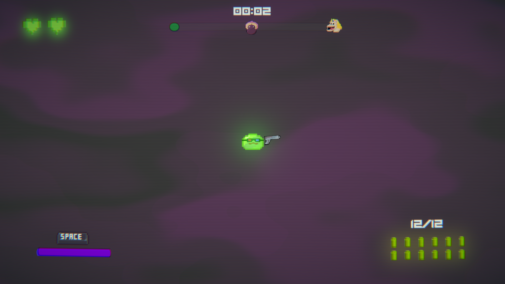
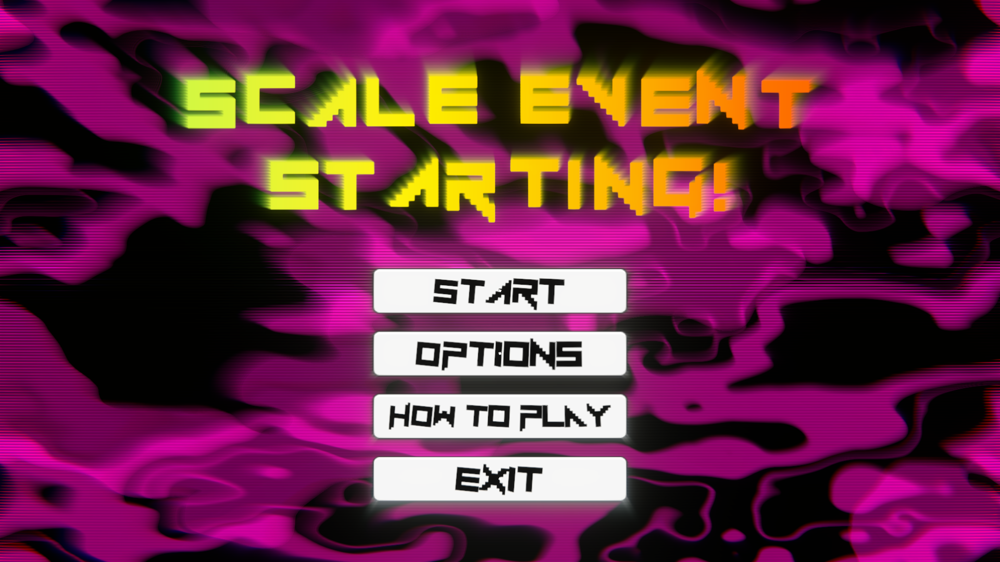

# Scale Event Starting!

_A high-octane Top-Down Shooter game developed in Unity during the GMTK 2024 Game Jam._

## Screenshots

## Table of Contents

- [About the Game](#about-the-game)
- [Features](#features)
- [Installation](#installation)
- [How to Play](#how-to-play)
- [Controls](#controls)
- [License](#license)
- [Acknowledgments](#acknowledgments)
- [Contributors](#contributors)

## About the Game

**Scale Event Starting!** is an action-packed Top-Down Shooter game developed over 96 hours for the **GMTK 2024 Game Jam**. Among 35,000 participants and over 7,600 game submissions, our game received **191 votes** and **150 comments**, ranking **30th** among the most voted games.

In this adrenaline-fueled experience, every 10 seconds triggers a new event or boss battle, keeping players constantly engaged. With 2 formidable bosses and 6 unique enemy types, your objective is to survive for 4 intense minutes using a variety of weapons, dash, and slow-motion abilities—all set to electrifying metal music.

Play the game on our [itch.io page](https://baytak.itch.io/scale-event-starting) and test your survival skills!

## Features

- **Dynamic Event System**: Every 10 seconds, adapt to new challenges with dynamic events and epic boss battles.
- **Diverse Enemies**: Face off against 6 different enemy types, each with unique behaviors and attack patterns.
- **Challenging Bosses**: Confront 2 powerful bosses at the 2-minute and 4-minute marks.
- **Weapon Variety**: Collect and wield various weapons that drop on the battlefield to enhance your firepower.
- **Special Abilities**: Utilize dash and slow-motion features to outmaneuver enemies and strategize your attacks.
- **Immersive Atmosphere**: Experience high-energy gameplay enhanced by metal music, visual effects, and dynamic camera movements.
- **"Built to Scale" Theme Integration**: Incorporates scaling mechanics such as character power-ups, environmental scaling, time manipulation, and dynamic music changes.

## Installation

### Play via itch.io

1. Visit our [itch.io page](https://baytak.itch.io/scale-event-starting).
2. Download the game for your platform.
3. Unzip the downloaded file.
4. Run the executable to start playing!

### Download the Executable

[Download the latest version](https://github.com/FurkanBaytak/Scale-Event-Starting/releases/tag/v1.0.0)

## How to Play

- **Objective**: Survive for 4 minutes against relentless waves of enemies and challenging bosses.
- **Events**: Every 10 seconds, new events or bosses appear—stay alert!
- **Weapons**: Collect weapons dropped on the ground to enhance your firepower.
- **Abilities**: Use dash to evade attacks and slow motion to gain a tactical advantage.
- **Strategy**: Manage your resources and time your abilities to withstand the escalating difficulty.

## Controls

- **Move**: `W` `A` `S` `D` or Arrow Keys
- **Aim**: Mouse Cursor
- **Shoot**: Left Mouse Button
- **Dash**: `Shift`
- **Slow Motion**: `Spacebar`
- **Pause**: `Esc`

## License

This project is licensed under the **MIT License**—see the [LICENSE](LICENSE) file for details.

## Acknowledgments

- **GMTK 2024 Game Jam**: Thanks to Mark Brown and the GMTK team for hosting an amazing event.
- **Unity Technologies**: For providing an excellent game development platform.
- **Community Feedback**: Huge appreciation to everyone who played the game and provided invaluable feedback.

## Contributors

- **[Furkan BAYTAK](https://github.com/FurkanBaytak)**
- **[Furkan OZKAYA](https://github.com/Elhier0)**
- **[Arda ATMACA](https://github.com/WaterArchery)**
- **[Mehmet Adil ARKAN](https://github.com/arkanmehmetadil)**

---
